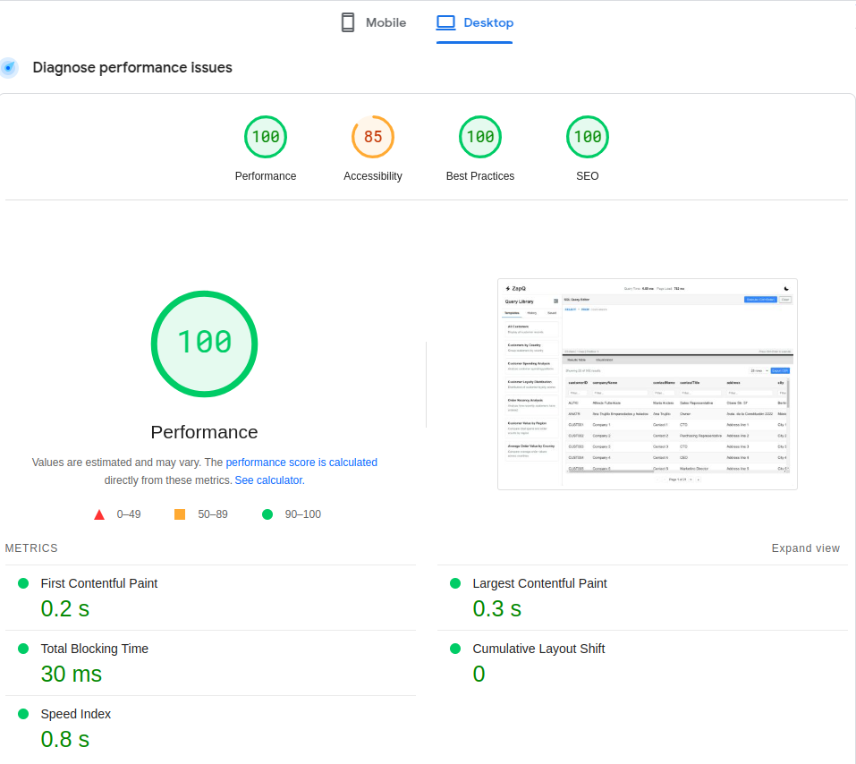

<div align="center">

  <h1>
    <br/>
    ZapQ
  </h1>

> ZapQ is a powerful web-based SQL query tool with real-time visualization capabilities, designed to help developers and analysts work with databases more efficiently.

  <p>
    <a href="https://github.com/your-username/sql-explorer/blob/main/LICENSE">
      
    </a>
    
    
  </p>

  <p>
    <a href="#overview">Overview</a> •
    <a href="#tech-stack">Tech Stack</a> •
    <a href="#performance">Performance</a> •
    <a href="#optimizations">Optimizations</a> •
    <a href="#installation">Installation</a> •
    <a href="#contributing">Contributing</a>
  </p>
</div>

---

## Overview

ZapQ is a modern web application that provides:

- A feature-rich SQL editor with syntax highlighting
- Real-time query execution and results display
- Interactive data visualizations
- Query history and saved queries functionality
- Performance metrics tracking
- Light/dark mode theming with smooth transitions

The application is designed to help developers and data analysts work with databases more efficiently by providing an intuitive interface with powerful features.

## Tech Stack

### Core Framework

- **Next.js** (React framework) - Chosen for its excellent performance, server-side rendering capabilities, and seamless API routes

### Major Dependencies

- **React** - UI component library
- **recharts** - Data visualization library
- **match-media** - For system theme preference detection
- **react-icons** - For importing and using icons

### Development Tools

- **ESLint** - JavaScript linting
- **Prettier** - Code formatting

## Performance



### Page Load Time

- Average load time: **800-900ms** (measured on production build)
- DOM Content Loaded: **800ms**
- First Contentful Paint: **0.2s**

### Measurement Methodology

Performance metrics are collected using:

1. **Navigation Timing API** - For core page load metrics
2. **Performance.mark()** - For custom timing measurements
3. **Lighthouse** - For comprehensive performance audits
4. **Chrome DevTools** - For detailed performance analysis

Key metrics tracked:

| Metric | Calculation |
|--------|-------------|
| Total Load Time | `loadEventEnd - startTime` |
| DOM Content Loaded | `domContentLoadedEventEnd - startTime` |
| First Paint | `responseEnd - startTime` |
| DNS Lookup | `domainLookupEnd - domainLookupStart` |
| TCP Connection | `connectEnd - connectStart` |

Example measurement implementation:

```javascript
// Using Navigation Timing API v2
const navigationEntry = performance.getEntriesByType('navigation')[0];

const metrics = {
    totalLoadTime: navEntry.loadEventEnd - navEntry.startTime,
    domContentLoaded: navEntry.domContentLoadedEventEnd - navEntry.startTime,
    firstPaint: navEntry.responseEnd - navEntry.startTime,
    dnsLookup: navEntry.domainLookupEnd - navEntry.domainLookupStart,
    tcpConnection: navEntry.connectEnd - navEntry.connectStart,
};
```

## Optimizations

### 1. Code Splitting

- Dynamic imports for heavy components (visualizations)
- Component-based code structure

### 2. Rendering Optimizations

- Virtualized tables for large datasets
- Efficient state management

### 3. Asset Optimization

- Compressed SVG icons
- Font subsetting

### 4. Data Fetching

- Cached query results
- Debounced input handlers
- Efficient pagination

## Installation

### Prerequisites

- Node.js v18+
- npm v9+ or yarn v1.22+
- Git

### Quick Start

1. **Clone the repository**

```bash
git clone https://github.com/KshitijThareja/ZapQ.git
cd ZapQ
```

2. **Install dependencies**

```bash
npm install
#or
yarn install
```

3. **Run development server**

```bash
npm run dev
#or
yarn dev
```
